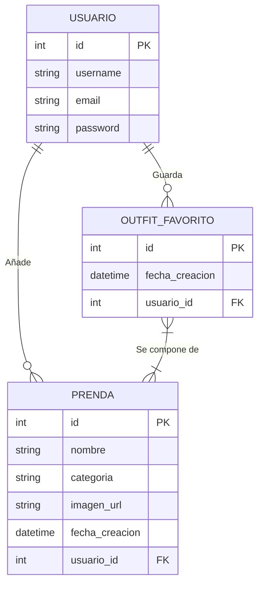
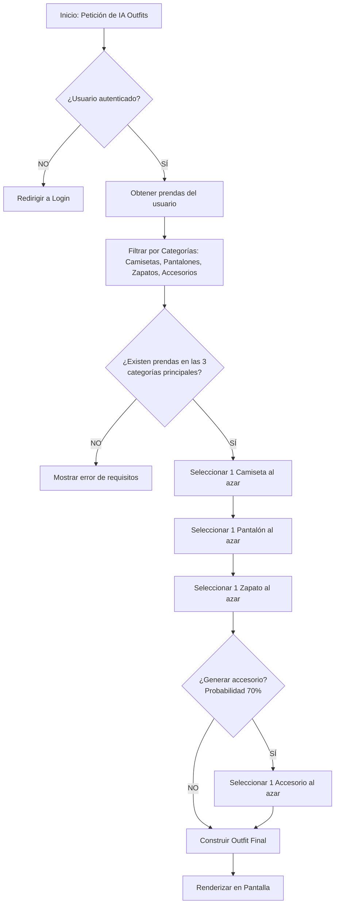

# Memoria Técnica: Proyecto DressMe

---

## 1. Introducción

### 1.1 Contexto y Justificación
El proyecto **DressMe** nace para solucionar un problema cotidiano al que se enfrentan miles de personas diariamente: la toma de decisiones frente al armario. A menudo, las personas invierten una cantidad innecesaria de tiempo intentando combinar prendas, o acaban usando siempre las mismas combinaciones por falta de creatividad o memoria sobre las prendas disponibles. 
Digitalizar el inventario personal no solo agiliza este proceso, sino que fomenta una moda más sostenible, permitiendo al usuario visualizar toda su ropa y evitar compras redundantes.

### 1.2 Objetivos
**Objetivo General:**
Desarrollar una aplicación web transaccional que permita a los usuarios digitalizar su ropa y automatizar la creación de conjuntos (*outfits*) mediante algoritmos de selección lógica.

**Objetivos Específicos:**
- Implementar un sistema de autenticación de usuarios seguro.
- Desarrollar un sistema de gestión (CRUD) para subir imágenes de ropa y categorizarlas (Camisetas, Pantalones, Zapatos, Accesorios).
- Diseñar un algoritmo generativo capaz de proponer conjuntos lógicamente viables.
- Crear un panel de control interactivo (Dashboard) con estadísticas de uso en tiempo real.
- Diseñar una interfaz de usuario atractiva, *responsive* y optimizada utilizando exclusivamente CSS nativo para garantizar el máximo rendimiento.

---

## 2. Análisis y Requisitos del Sistema

### 2.1 Requisitos Funcionales (RF)
- **RF-01**: El sistema debe permitir el registro, inicio y cierre de sesión de los usuarios.
- **RF-02**: El sistema debe permitir al usuario subir una foto de una prenda, nombrarla y asignarle una categoría.
- **RF-03**: El sistema debe permitir al usuario eliminar una prenda, lo cual debe borrar la imagen física del servidor para ahorrar espacio.
- **RF-04**: El sistema debe generar un conjunto (*outfit*) compuesto obligatoriamente por una prenda superior, una inferior y un calzado, con la posibilidad de añadir accesorios opcionales.
- **RF-05**: El sistema debe permitir al usuario guardar sus conjuntos favoritos.
- **RF-06**: El sistema debe mostrar un panel con el recuento de prendas totales y los últimos conjuntos generados.

### 2.2 Requisitos No Funcionales (RNF)
- **RNF-01 (Seguridad)**: Las contraseñas deben cifrarse usando algoritmos robustos (PBKDF2). Todo formulario debe estar protegido contra CSRF.
- **RNF-02 (Rendimiento)**: El motor de vistas debe responder en menos de 500ms y los assets deben servirse minificados.
- **RNF-03 (Usabilidad)**: La interfaz debe ser intuitiva, libre de recargas innecesarias de página completa cuando sea posible, y adaptable a dispositivos móviles.

---

## 3. Arquitectura y Esquemas (Diseño del Sistema)

### 3.1 Patrón de Arquitectura
El sistema ha sido desarrollado bajo el framework **Django**, el cual utiliza el patrón **MTV (Model-Template-View)**:
- **Modelo**: Actúa como la capa de abstracción de datos, mapeando objetos Python a tablas relacionales SQL.
- **Plantilla (Template)**: Actúa como la capa de presentación, procesando HTML dinámico a través del DTL (Django Template Language).
- **Vista (View)**: Actúa como el controlador lógico, procesando peticiones HTTP, consultando al Modelo y devolviendo una Plantilla.

### 3.2 Esquema Entidad-Relación (BBDD)



*Descripción del Esquema*: Se utiliza un modelo relacional estricto. La relación entre `OutfitFavorito` y `Prenda` es de **Muchos a Muchos (M:N)**, lo que Django maneja a través de una tabla intermedia transparente. Se utiliza integridad referencial con borrado en cascada (ON DELETE CASCADE) de modo que, si un usuario se da de baja, todo su historial desaparece del sistema cumpliendo con el RGPD.

### 3.3 Esquema del Algoritmo Generativo



---

## 4. Desarrollo e Implementación

### 4.1 Tecnologías Utilizadas
- **Backend**: Python 3.11, Django 5.0.3.
- **Base de Datos**: SQLite (entorno local) / PostgreSQL (entorno de producción).
- **Frontend**: HTML5 Semántico, CSS3 Nativo (uso avanzado de Grid, Flexbox y Custom Properties `:root`).
- **Librerías Adicionales**: `Pillow` (para el procesamiento binario de imágenes multiplataforma), `gunicorn` y `whitenoise` (para el despliegue de estáticos en producción).

### 4.2 Lógica de Destrucción de Archivos (Signals)
Para evitar saturar el almacenamiento del servidor con archivos huérfanos, se implementó una señal de Django:
```python
@receiver(post_delete, sender=Prenda)
def eliminar_imagen_al_borrar_prenda(sender, instance, **kwargs):
    if instance.imagen and os.path.isfile(instance.imagen.path):
        os.remove(instance.imagen.path)
```
Esto garantiza que la recolección de basura no solo ocurra a nivel de base de datos, sino a nivel de sistema de ficheros del sistema operativo.

### 4.3 Diseño UI/UX
En lugar de depender de *frameworks* pesados como Bootstrap, se diseñó una hoja de estilos nativa (`styles.css` con más de 1000 líneas). Esto permite:
- Un control absoluto sobre animaciones y transiciones (micro-interacciones al hacer hover).
- Menor peso de descarga en el lado del cliente (mejor First Contentful Paint).
- Implementación de un diseño "Glassmorphism" con desenfoques (backdrop-filter) que da una apariencia Premium al Dashboard.

---

## 5. Presupuesto del Proyecto

El desarrollo de este software a medida tiene un coste estimado calculado en base a los recursos técnicos y humanos invertidos.

### 5.1 Costes de Hardware e Infraestructura
| Concepto | Cantidad | Coste Unitario Estimado (€) | Coste Total (€) |
|----------|----------|-----------------------------|-----------------|
| Equipo de desarrollo (Amortización) | 1 | 150,00 | 150,00 |
| Servidor Cloud (Railway - 1 año) | 1 | 60,00 | 60,00 |
| Dominio Web (1 año) | 1 | 12,00 | 12,00 |
| **Subtotal Hardware/Infraestructura** | | | **222,00 €** |

### 5.2 Costes de Software (Licencias)
| Concepto | Coste (€) |
|----------|-----------|
| Python / Django (Open Source) | 0,00 |
| Editor de Código (VS Code) | 0,00 |
| SQLite / PostgreSQL | 0,00 |
| **Subtotal Software** | **0,00 €** |

### 5.3 Costes de Personal (Desarrollo)
Se estima un desarrollo de 120 horas repartidas entre planificación, diseño, backend, frontend y pruebas.

| Rol | Horas | Tarifa Hora (€) | Coste Total (€) |
|-----|-------|-----------------|-----------------|
| Analista / Diseñador de BBDD | 20 | 35,00 | 700,00 |
| Programador Backend (Python) | 50 | 30,00 | 1.500,00 |
| Programador Frontend (UI/UX) | 40 | 25,00 | 1.000,00 |
| QA Tester (Pruebas) | 10 | 20,00 | 200,00 |
| **Subtotal Personal** | **120** | | **3.400,00 €** |

### 5.4 Resumen de Presupuesto
| Concepto | Coste Total (€) |
|----------|-----------------|
| Hardware e Infraestructura | 222,00 |
| Software | 0,00 |
| Personal de Desarrollo | 3.400,00 |
| **Base Imponible** | **3.622,00 €** |
| IVA (21%) | 760,62 € |
| **PRESUPUESTO TOTAL** | **4.382,62 €** |

---

## 6. Conclusiones y Trabajo Futuro

### 6.1 Conclusiones
El proyecto ha cumplido satisfactoriamente con los objetivos propuestos. Se ha desarrollado una aplicación robusta, altamente eficiente gracias al uso de CSS nativo y el ORM optimizado de Django. Se ha logrado una plataforma intuitiva que facilita a los usuarios la gestión de su vestuario de manera completamente digital y segura.

### 6.2 Posibles Mejoras (Escalabilidad)
- **Computer Vision (IA Real):** Implementación de una red neuronal convolucional (CNN) o conexión con la API de OpenAI Vision para que, al subir una foto, el sistema detecte automáticamente el color y la categoría (Camiseta, Pantalón) sin que el usuario deba indicarlo.
- **Aplicación Móvil (PWA):** Convertir el proyecto en una Progressive Web App para permitir a los usuarios tomar la foto directamente con la cámara de su smartphone.
- **Moda Social:** Añadir funcionalidades para compartir conjuntos generados con otros usuarios en la plataforma.

---

## 7. Bibliografía y Webgrafía

1. **Django Software Foundation.** (2024). *Django Documentation*. Recuperado de: [https://docs.djangoproject.com/](https://docs.djangoproject.com/)
2. **Python Software Foundation.** (2024). *Python 3.11 Reference Manual*. Recuperado de: [https://docs.python.org/3/](https://docs.python.org/3/)
3. **MDN Web Docs.** (2023). *CSS: Cascading Style Sheets*. Recuperado de: [https://developer.mozilla.org/en-US/docs/Web/CSS](https://developer.mozilla.org/en-US/docs/Web/CSS)
4. **Clark, A. et al.** (2024). *Pillow (PIL Fork) Documentation*. Recuperado de: [https://pillow.readthedocs.io/](https://pillow.readthedocs.io/)
5. **Krug, S.** (2014). *Don't Make Me Think, Revisited: A Common Sense Approach to Web Usability*. New Riders.
6. **Elmasri, R., & Navathe, S. B.** (2015). *Fundamentals of Database Systems* (7th ed.). Pearson.
